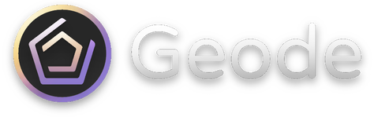

### [Home page](https://geode-sdk.org)

**Geode** is a [Geometry Dash](https://store.steampowered.com/app/322170/Geometry_Dash/) **mod loader** and **modding SDK** with a modern approach towards mod development. Unlike previous mod loaders, which merely inject the DLLs and let devs handle the rest, Geode aims to be a more comprehensive project that provides all the tools needed for creating mods in one package.

Geode's goal is to solve **mod incompatability** - to ensure that mods work together without buttons getting misplaced or hooks mysteriously disappearing.

## Why Geode?

Here's a **Hello World** mod in Geode:

```cpp
#include <Geode/Bindings.hpp>
#include <Geode/modify/MenuLayer.hpp>

using namespace geode::prelude;

class $modify(MenuLayer) {
	void onMoreGames(CCObject*) {
		FLAlertLayer::create(
			"Geode",
			"Hello World from my Custom Mod!",
			"OK"
		)->show();
	}
};
```

This code changes what happens when the "More Games" button is clicked in Geometry Dash, showing a popup.

## Documentation

Detailed documentation, tutorials, and installation instructions on using Geode can be found [here](https://docs.geode-sdk.org).

New to modding GD? Geode's documentation also comes with a handy [tutorial book](https://docs.geode-sdk.org/#/handbook/chap0) that explains all the basics of GD modding!

## Contribution

You can contribute to Geode by opening a [Pull Request](https://github.com/geode-sdk/geode/pulls)! Please follow the contribution guidelines.

## Questions, help, etc.

If you have any further questions, need help, or just want to share your love for catgirls, be sure to join [our Discord server](https://discord.gg/9e43WMKzhp)!
